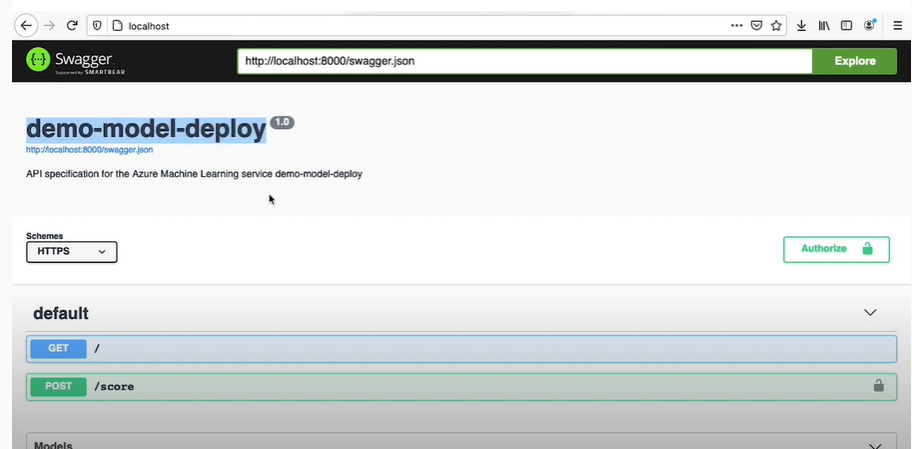

*NOTE:* This file is a template that you can use to create the README for ymy project. The *TODO* comments below will highlight the information you should be sure to include.

# Operationalizing-Machine-Learning

## Overview
This project is part of the Udacity Azure ML Nanodegree (Microsoft Azure Machine Learning Engineer with Microsoft Azure - Course 3: ). In this project, I use the Bank marketing datasets and Azure to configure a cloud-based machine learning production model, deploy it, and consume it. I also created, published, and consumed a pipeline to automate the process.

## Architectural Diagram
Here is my architecture diagram for this project:

**Deploy the Model - Running Jupyter Notebook file: deploy-model-inazure-ML.ipynb**

**Publish Pipeline - Running Jupyter Notebook file: public-an-machine-learning-pipeline.ipynb**

Let me explore some key of the component in this project:
- **1. Authentication**: In this step, I need to create a Security Principal (SP) to interact with the Azure Workspace. Since I used the Udacity lab for the project, I skipped this step
- **2. Automated ML Experiment**: In this step, I create an experiment using Automated ML, configure a compute cluster, and use that cluster to run the experiment.
- **3. Deploy the best model**: Deploying the Best Model will allow us to interact with the HTTP API service and interact with the model by sending data over POST requests.
- **4. Enable logging**: Logging helps monitor my deployed model. It helps us know the number of requests it gets, the time each request takes, etc.
- **5. Swagger Documentation**: In this step, I consume the deployed model using Swagger.
- **6. Consume model endpoints**: I interact with the endpoint using some test data to get inference.
- **7. Create and publish a pipeline**: In this step, I automate this workflow by creating a pipeline with the Python SDK.

## Key Steps
**1. Authentication**

I used the lab Udacity for this exercise, so I skipped this step since I'm not authorized to create a security principal.

**2. Automated ML Experiment**

For this step, I used the **deploy-model-inazure-ML.ipynb** Jupyter Notebook file to create a Automated ML Experiment.
I created an AutoML experiment to run using the **Bank Marketing Dataset** loaded in the Azure Workspace, choosing 'y' as the target column.
I uploaded this dataset into Azure ML Studio in the Registered Dataset Section using the Local file or URL provided in the project.
I used the **Standard_DS3_v2** for the Virtual Machine and 1 as the minimum number of nodes.
I ran the experiment using classification, without enabling Deep Learning. The run took some time to test various models and find the best model for the task.
From my run, the best-performing model is the voting ensemble as shown below.

**Registered Dataset**

**Created Compute Instance**

**Created Compute Cluster**

**Experiment Created**

**Created AutoML Experiment**

**running AutoML Experiment**

**Best Model**

****List of the Best models****
.png>)

****the Best models****

****Best model metrics****
.png>)
.png>)

**3. Deploy Best Model**

The best model from my AutoML run is deployed into production using Azure Container Instance (ACI) and I can access endpoints through which other services can interact with my deployed model. 
I also enable authentication during deployment so keys are generated that other services can use to authenticate before interacting with my deployed model.
**Enable loggin**

**Deploy the best model using Azure Container Instance (ACI) with Authentication enabled**

**4. Enable logging**

After deploying the best model, I can enable Application Insights and retrieve logs.
Enabling Application Insights and Logs could have been done at the time of deployment, but for this project, I achieved it using Azure Python SDK. Running the **logs.py** script requires interactive authentication

I enable application insights by adding this line to the script: **service.update(enable_app_insights = True)**

**5. Swagger Documentation**

To consume my best AutoML model using Swagger, I first need to download the **swagger.json** file provided to us in the Endpoints section of Azure Machine Learning Studio. Then I run the **swagger.sh** and **serve.py** files to be able to interact with the swagger instance running with the documentation for the HTTP API of the model.

**Running Swagger in docker**

**Localhost**
.png>)

**Swagger documentation for the HTTP API of the model**

**7. Create and publish a pipeline**

For this step, I used the **public-an-machine-learning-pipeline.ipynb** Jupyter Notebook file to create a Pipeline. I created, consumed and published the best model for the bank marketing dataset using AutoML with Python SDK.

**Create a Pipeline in the SDK**

**Pipeline in Azure Studio**

**Pipeline training**
.png>)

**Run Completed**

**Run Completed - Metric outputs**

.png>)
.png>)

**Run Completed - The best model**

**Consume a pipeline Endpoint - Completed**

**Pipeline Rest Endpoint - Metrics**

## Screen Recording
- The virtual environment on Udacity is not compatible with all the steps like the real environment, so there are many limitations for learners. 

- The virtual environment on Udacity running Azure  Automated ML Experiment to train is quite slow and takes almost all the time of the Lab environment allowed on Udacity --> I don't have enough time to record a video --> please follow the steps and results I have done above and evaluate

## Standout Suggestions

- Since the data is highly imbalanced, use a technique to first handle the imbalance issue to improve the model predictions
- Enable deep learning which will train more models and may yield a better performing model
- Run on an environment with a stronger CPU/GPU for faster model training
